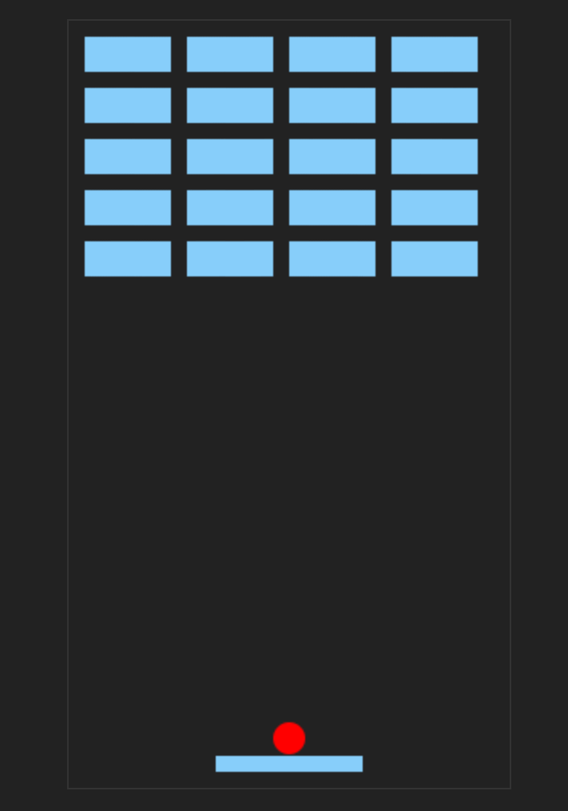

# 2D Breakout Game

Adaptation of the famous Breakout game, in 2D using pure JavaScript.

> In Breakout, a layer of bricks lines the top third of the screen and the goal is to destroy them all. A ball moves straight around the screen, bouncing off the top and two sides of the screen. When a brick is hit, the ball bounces back and the brick is destroyed. The player loses a turn when the ball touches the bottom of the screen; to prevent this from happening, the player has a horizontally movable paddle to bounce the ball upward, keeping it in play.

# Contributing
As a free and open source game, 2d Breakout Game is the product of many peoples' work. Contributions of artwork, storylines, and other writing are most in-demand, while there is a loosely defined [development roadmap]
Those who wish to contribute are encouraged to review the [wiki](https://github.com/itzshoaibmalik/2d-Breakout-Game/en/wiki), and to post in the [discussion forum](http://groups.google.com/group/endless-sky).

# Licensing
2d Breakout Game is a free, open source game. The [source code](https://github.com/itzshoaibmalik/2d-Breakout-Game/) is available under the GPL v3 license, and all the artwork is either public domain or released under a variety of Creative Commons licenses. (To determine the copyright status of any of the artwork, consult the [copyright file](https://github.com/endless-sky/endless-sky/blob/master/copyright).)
